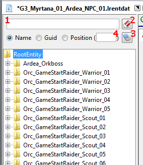

# 1. Einrichtung
Unter dem Menüpunkt Datei->Einstellungen findet ihr den Einstellungsdialog von g3dit. Dieser gestaltet sich sehr übersichtlich.

## 1.1 Allgemein

### 1.1.1 Data Verzeichnise
Ein Data Verzeichnis könnt ihr euch wie das Gothic 3 Data Verzeichnis mit entpackten *.pak's* vorstellen.
Genau genommen benötigt g3dit nur *Projects_compiled* und *Templates*.

* **1. Data Verzeichnis** 
Hier befinden sich die modifizierten Dateien, z.B. neue/veränderte Templates oder Weltdaten-Sektoren. Dateien in diesem Verzeichnis überdecken gleichnamige aus dem 2. Data Verzeichnis
* **2. Data Verzeichnis** 
Hier befinden sich die entpackten Inhalte der originalen *.pak's*, *.pxx's* und *.cpt's*.

Für die Verzeichnisse könnt ihr jeweils einen Alias eintragen, welcher dann an allen Stellen in g3dit, an denen Pfade zu Dateien angezeigt werden, den Pfad bis zum Data Verzeichnis ersetzt.

### 1.1.2 Backup beim Speichern
Wenn ihr diese Option aktiviert, legt g3dit vor dem Speichern einer Datei, eine Backup Datei an (gleicher Name, nur *.bak* angehänt), die dem Stand der Datei vor dem Speichern entspricht.
## 1.2 Dateiendungen
Hier könnt ihr auswählen, welche Dateiendungen mit g3dit verknüpft sein sollen. Wenn eine Dateiendung mit g3dit verknüpft ist, könnt ihr Dateien, mit dieser Dateiendung, mit einem Doppelklick in g3dit öffnen.

# 2. Öffnen, Erstellen und Speichern
Mit g3dit könnt ihr *.lrentdat*, *.node* und *.secdat* Dateien öffnen, bearbeiten und natürlich wieder abspeichern.
Das geht über das Datei Menü, über Tastenkürzel oder per Drag'n'Drop.
* **Öffnen (Strg+O)** 
Öffnet einen Dateibrowser, in dem man die gewünschte Datei auswählen kann. 
Um eine Datei per Drag'n'Drop zu öffnen, müsst ihr sie einfach in das Programmfenster von g3dit hineinziehen.
* **Neu** 
Erstellt wahlweise eine leere *.lrentdat*, *.node* und *.secdat* Datei und zeigt diese an.
* **Speichern (Strg+S)** 
Speichert die Änderungen an der aktuell geöffneten Datei und überschreibt dabei die alte Datei.
* **Speichern Unter** 
Speichert die Änderungen an der aktuell geöffneten Datei, aber lässt euch die Wahl wohin die Datei geschrieben werden soll.
* **Letzte Dateien** 
Hier werden die zuletzt geöffneten Dateien angezeigt und sind so schnell wieder erreichbar.

# 3. Bearbeiten von .lrentdat/.node Dateien
## 3.1 Entity Auflistung
Auf der linken Seite des Fensters findet ihr die Auflistung aller Entities, der ausgewählten Datei.

### 3.1.1 Suche
Die Auflistung bietet die Möglichkeit, die Entities nach bestimmten Kriterien zu filtern. Den Suchtext könnt ihr in die Textbox(1) eintragen. Mit dem *'Suche leeren'*-Button(2) könnt ihr das Suchfeld auf einen schlagen leeren.
Es gibt drei verschiedene Suchkriterien.

#### 3.1.1.1 Name
Es werden alle Entities angezeigt, deren Name den eingegebenen Suchtext enthält.
 Wenn ihr dem Suchtext ein `#` voranstellt, welches von einer Zahl gefolgt wird, wird nur die Entity angezeigt, die diese Nummer hat.

#### 3.1.1.2 Guid
Es werden alle Entities angezeigt, deren Guid zum eingegeben Suchtext passt. Ihr könnt komplette Guids eingeben oder auch nur den Teil einer Guid.
  Es gibt drei mögliche Formate, in denen die Guid eingegeben werden kann:

- Text: `CSPGIVNdlg5gmm38`
- Hex: `4353504749564E646C6735676D6D3338(00000000)` (die acht Nullen am Ende können wahlweise weggelassen werden)
- UUID: `47505343-5649-644E-6C67-35676D6D3338`

Desweiteren könnt ihr außer nach Entity Guids, auch nach Routine-Guids (`#r#` voranstellen) oder nach InventoryStack-Guids (`#i#` voranstellen) suchen.

#### 3.1.1.3 Position
Es werden alle Entities angezeigt, deren Entfernung von den im Suchtext eingegeben Koordianten, kleiner gleich der in der Textbox(4) eingegeben Zahl ist. Wenn in Textbox(4) keine Zahl angegeben ist, muss die Position exakt übereinstimmen (entspricht Wert 0).
  Die Position könnt ihr im Suchfeld in der Form `x/y/z` bzw. `x/y/z//` eintragen.

### 3.1.2 Einstellungen
Der Button(3) öffnet ein Menü, in dem ihr einige Einstellungen vornehmen könnt.

* **Entity Nummer anzeigen:** Nummer der Entity wird neben dem Namen angezeigt.
* **Subentities anzeigen:** Wenn eine Entity die Suchkriterien erfüllt, werden zusätzlich zur ihr, auch alle ihre SubEntities angezeigt. (auch wenn diese die Suchkriterien nicht erfüllen)

### 3.1.3 Struktur anpassen
Per Drag'n'Drop oder über das Kontextmenü (Rechtsklick auf eine Entity bzw. eine Menge ausgewählter Entities) könnt ihr die Reihenfolge und die Parents der Entities anpassen.
 Über das Kontextmenü könnt ihr außerdem Entities löschen und klonen, d.h. es wird eine, bis auf die neu generierte Guid, exakte Kopie einer Entity angefertigt.
 Wenn ihr einen NPC klont, werden automatisch auch alle seine Körperteile geklont und dem geklonten NPC zugewiesen.

## 3.2 Ansichten
Es gibt drei verschiedene Ansichten, in denen ihr unterschiedliche Aspekte einer Entity bearbeiten könnt.
 Zwischen den Views könnt ihr in der Statusleiste, am unteren Rand des Programmfensters, umschalten.

### 3.2.1 Entity bearbeiten (E)
In dieser Ansicht könnt ihr die Eigenschaften einer Entity anpassen, d.h. so Sachen wie Name, Guid, Position, Routinen, Inventar oder die ganzen Eigenschaften die einen NPC ausmachen.

### 3.2.2 Beleuchtung (B)
In dieser Ansicht könnt ihr Entities beleuchten, die nicht mit Lightmaps, sondern über die Angabe von maximal vier Lichtquellen, am Ende der eCIlluminated_PS Klasse, beleuchtet werden.
  Das Ergebnis entspricht natürlich nicht ganz der Qualität, die eine Berechnung durch die Gothic 3 Engine liefern würde (deren Verwendung leider (noch) nicht möglich ist).

* **Aktuelle Beleuchtung:** Zeigt euch an, wie die ausgewählten Entities beleuchtet sind.

* **Beleuchten:** Berechnet euch die Beleuchtung, der ausgewählten Entities, neu.

### 3.2.3 NegCircle (N)
In dieser Ansicht könnt ihr NegCircles für Entities erstellen und löschen. Ob ihr für eine Entity einen NegCircle erstellen könnt, hängt davon ab, ob für das Mesh der Entity, ein Prototyp Eintrag in der Datei `config/NegCirclePrototype.txt` existiert. Für alle Standard Gothic 3 Meshes ist in der Datei bereits ein Eintrag vorhanden. Ihr könnt natürlich auch euren eigenen Einträge, für neue Meshes erstellen.

* **NegCircles erstellen:** Erstellt euch für jede ausgewählte Entity einen NegCircle, falls für diese Entity noch keiner existiert.

* **NegCircles löschen:** Löscht euch für euch den NegCircle jeder ausgewählten Entity, falls für diese Entity einer existiert.

* **Gelöschte NegCircle-Objekte suchen:** Sucht für euch nach NegCircles, deren zugeordnete Entity nicht existiert. Das kann der Fall sein, wenn ihr die Entity im Zuge eurer Modifikationen gelöscht habt. Es gibt auf der anderen Seite aber auch NegCircles, die absichtlich ohne zugeordnete Entity in die Welt gesetzt wurden. Damit diese nicht fälschlicherweise angezeigt (und dann ausversehen gelöscht) werden, müsst ihr sie in die Datei `config/NegCirclesWithoutObject.txt` eintragen. Für alle, im unmodifizierten Spiel, objektlosen NegCircles, existiert bereits ein Eintrag in der Datei.

* **Manuell entfernen (Guids angeben):** Fordert euch zur Eingabe einer Liste von Guids auf und löscht anschließend alle NegCircles, die eine dieser Guids haben. Die Liste muss nicht ausschließlich aus Guids bestehen, es können auch Zeilen dabei sein, die keine Guids enthalten. Somit ist es möglich die Ausgabe, den euch die Suche nach gelöschten NegCircle-Objekten liefert, direkt als Eingabe für diese Funktion zu verwenden.